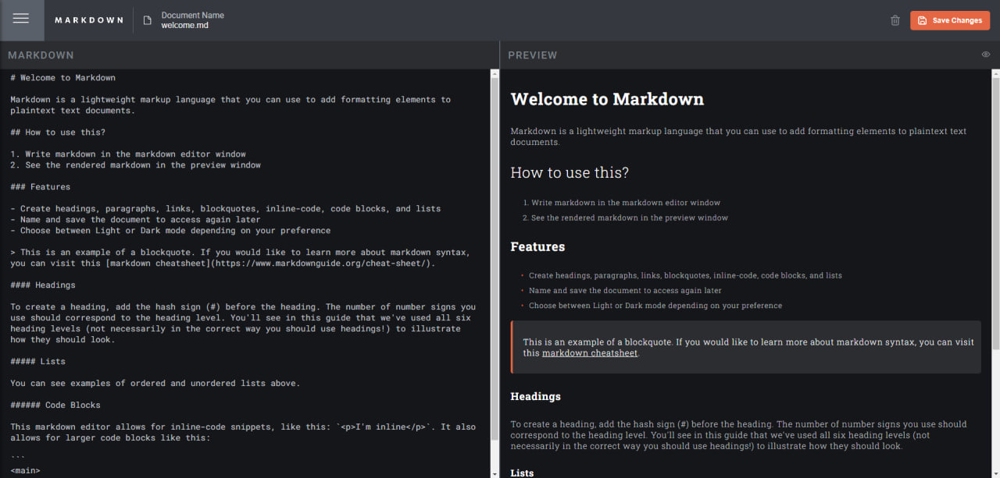
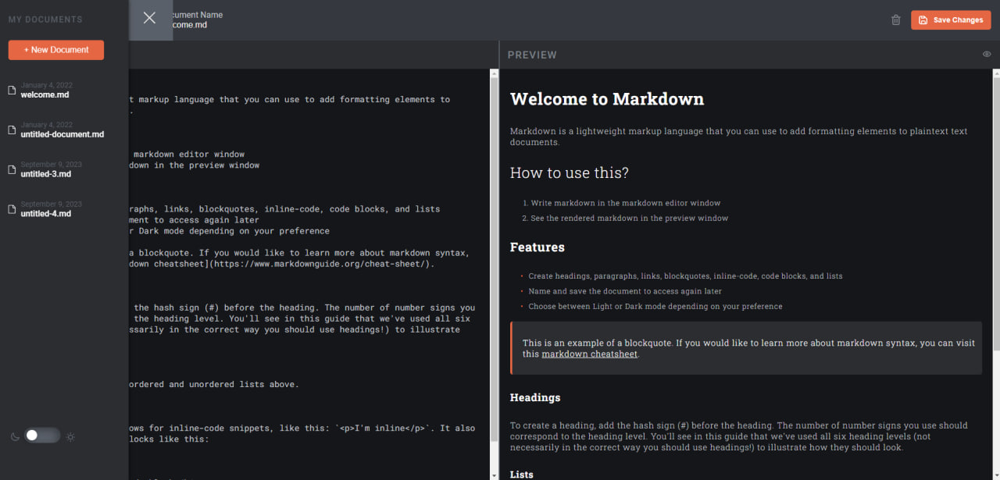
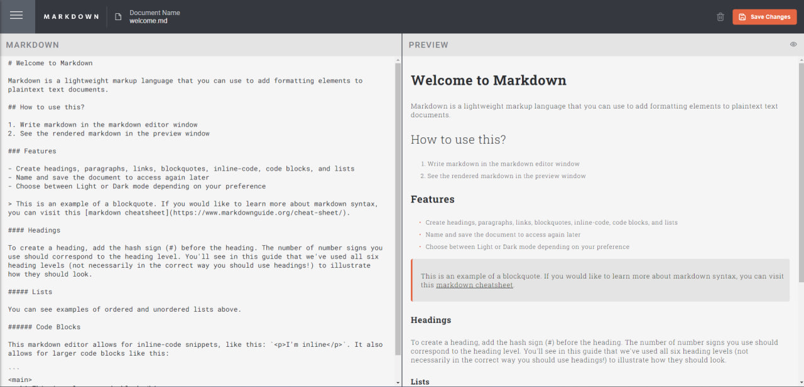

# Frontend Mentor - In-browser markdown editor

This is a solution to the [In-browser markdown editor challenge on Frontend Mentor](https://www.frontendmentor.io/challenges/inbrowser-markdown-editor-r16TrrQX9). Frontend Mentor challenges help you improve your coding skills by building realistic projects.

## Table of contents

- [Overview](#overview)
  - [The challenge](#the-challenge)
  - [Screenshot](#screenshot)
  - [Links](#links)
- [My process](#my-process)
  - [Built with](#built-with)
  - [How to Set Up](#how-to-set-up)

## Overview

### The challenge

Users should be able to:

- Edit the markdown of a document and see the formatted preview of the content
- View a full-page preview of the formatted content
- View the optimal layout for the app depending on their device's screen size
- See hover states for all interactive elements on the page

### Screenshot






### Links

- Live Site URL: [https://rochifox.github.io/browser-markdown-editor/]

## My process

### Built with

Frontend:

- React
- Redux
- SCSS
- Vite
- React-markdown library

Backend: 
- PHP
- Laravel
- MySQL

### How to Set Up

1. Clone the Git Repository:

   Run ```git clone https://github.com/RochiFox/browser-markdown-editor.git```

2. cd into the project directory:

   Run ```cd browser-markdown-editor```

## Backend

3. cd into the "server" folder: 
   Run ```cd server```

4. Copy .env.example file and rename as .env;

5. Edit database credentials in your newly generated/created .env file

6. Run ```composer install``` to install all libraries and dependencies in the composer.lock file 

7. Having created a database, and specifying the same with the right credentials in your .env file, run ```php artisan migrate``` to create the tables

8. Run ```php artisan serve``` to run the PHP development server. Alternatively, you can run your project with XAMPP or WAMP.

## Frontend

9. cd into the "client" folder:
   Run ```cd client```

10. Run ```npm install``` to download all packages and dependencies needed for our client

11. While making sure that the API (Laravel) Server is up and running, run ```npn run dev``` to start your react application

Congratulations!!!