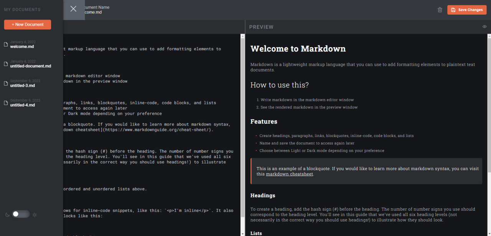
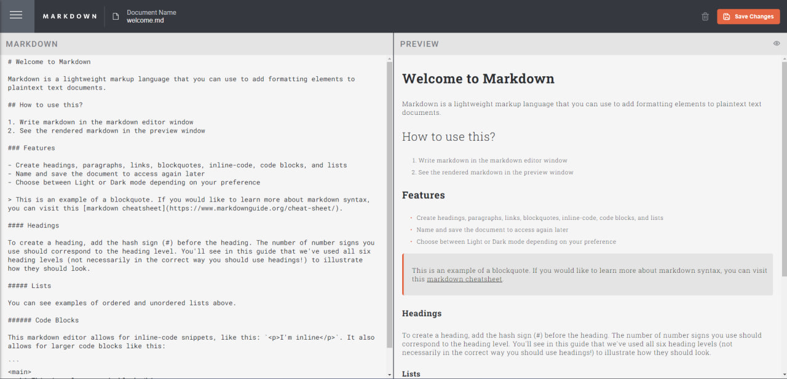
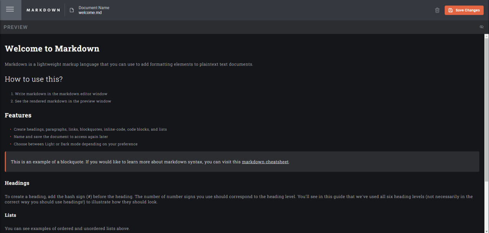

# Frontend Mentor - In-browser markdown editor

This is a solution to the [In-browser markdown editor challenge on Frontend Mentor](https://www.frontendmentor.io/challenges/inbrowser-markdown-editor-r16TrrQX9). Frontend Mentor challenges help you improve your coding skills by building realistic projects.

## Table of contents

- [Overview](#overview)
  - [The challenge](#the-challenge)
  - [Screenshot](#screenshot)
  - [Links](#links)
- [My process](#my-process)
  - [Built with](#built-with)

## Overview

### The challenge

Users should be able to:

- Edit the markdown of a document and see the formatted preview of the content
- View a full-page preview of the formatted content
- View the optimal layout for the app depending on their device's screen size
- See hover states for all interactive elements on the page

### Screenshot

### Links

- Live Site URL: [https://rochifox.github.io/browser-markdown-editor/]

## My process

### Built with

- React
- Redux
- SCSS
- Vite
- React-markdown library